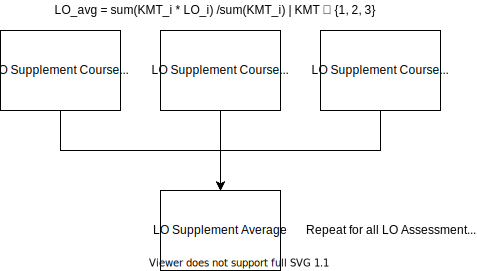
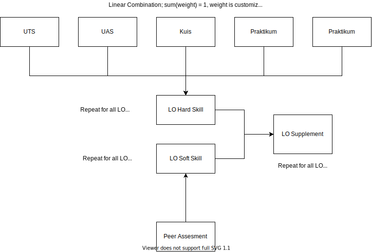

# SIY Backend

> Typescript-based REST API for SIY by 09-FTMD


## Requirements

Below are listed the requirements to run this application.

- Node 12 or higher ([https://nodejs.org/en/](https://nodejs.org/en/))
- Yarn package manager ([https://yarnpkg.com/](https://yarnpkg.com/))
- PostgreSQL ([https://www.postgresql.org/](https://www.postgresql.org/))

Some optional requirements for development, but recommended (as a VSCode extension):

- ESlint
- Prettier

## Stack Used

- Express.js with `routing-controller`
- Typescript
- PrismaORM
- TypeDI
- Redoc for OpenAPI docs
- Husky for pre-commit hook

## Scripts

`yarn start help` will show you all the possible commands and their descriptions. Alternatively, you can see the description via the `package-scripts.js` file in the root directory. This project uses the `nps` package to manage scripts.

Below are listed several notable scripts to be used in development:

- `yarn dev` - starts the development server.
- `yarn schema:migrate` - migrates the database schema into existing PostgreSQL database
- `yarn test` - runs integration and unit testing.
- `yarn lint` - Use

## Using With Docker

Additionaly, the Dockerfile has been included in this repository. Use:

```
docker build -t <image-name>:<image-tag> .
```

and to run the image, use:

```
docker run <image-name>:<image-tag>
```

## Additional Informations

### Contributors

<a href="https://github.com/mkamadeus/siy-backend/graphs/contributors">
  
</a>

### Flowcharts

Below flowchart is showing the flow of calculating LO, CO, CA, and many more.





