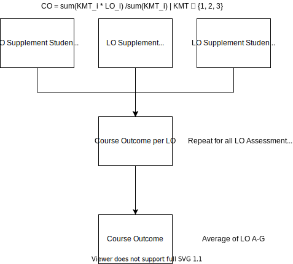
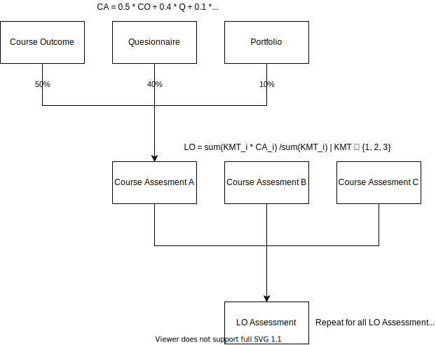

# siy-backend

> Typescript-based REST API

## Requirements

Below are listed the requirements to run the API.

- Node 12 or higher
- npm/yarn, yarn is preferred

## Scripts

`yarn start help` will show you all the possible commands and their descriptions. Alternatively, you can see the description via the `package-scripts.js` file in the root directory. This project uses the `nps` package to manage scripts.

## Flowcharts

Below flowchart is showing the flow of calculating LO, CO, CA, and many more.

